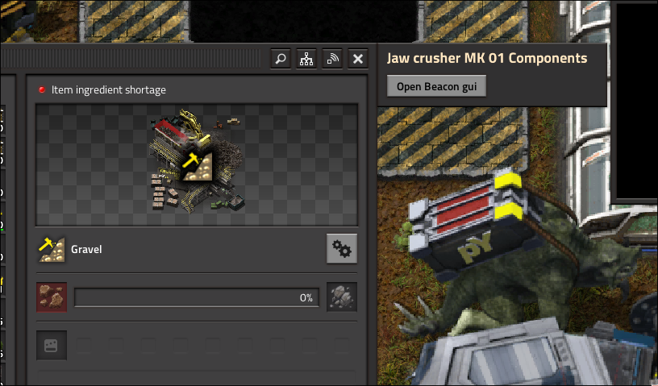

# Compound Entities
*As of August 16th, 2025*<br>

Compound entities are entities made up of multiple entities. For example vatbrains are just assembling-machines with a beacon hidden inside them.

These are typically a multi-step process of tracking these manually with storage variable and when things have been placed down and integrating GUI. This is to be put simply, annoying. So I (Lemon) did what any sane programmer would do and just made a special API for it.

## How to use?

The meat and potatoes of this api is that you can do this very easily just at data stage.

Here's a minimal example of how
```lua
local parent = "assembling-machine"
local child = "beacon"
py.compound_attach_entity_to(parent, child, {})
```
And then in the control stage
```lua
require "__pypostprocessing__.lib" -- If you don't have this somewhere already

-- This should be after every other compound entity function as well
py.register_compound_entities()
py.finalize_events() -- If you don't have this either already
```
That's it, you have an assembling machine with a beacon now.

Wait but what about that empty table at the end?

### Options

The `compound_attach_entity_to` function has a lot of options currently. Here's an exhaustive list:
```lua
-- Enable GUI to open the children
-- @function enable_gui bool

-- Sets the title for the GUI based of a custom function
-- @function gui_title fun(entity: LuaEntity): string

-- Sets a caption for the Button of the GUI
-- @function gui_caption string

-- Sets a custom function for the gui when it's being opened
-- @function gui_function_name fun(event: events.on_gui_opened, player: LuaEntity, gui_root: LuaGuiElement, current_index: number, gui_child: LuaGuiElement)
-- @param event events.on_gui_opened Event data of when on_gui_opened is called
-- @param player LuaEntity the player who opened the GUI
-- @param gui_root LuaGuiElement The root of the preset GUI that you can add to
-- @param current_index number The index of the compound-entity child you are
-- @param gui_child LuaGuiElement The Button you are in the the gui_root

-- Sets a custom function to run when you press the submenu button
-- @function gui_submenu_function_name fun(entity: LuaEntity): (LuaGuiElement | LuaEntity)
```

### Example

```lua
py.compound_attach_entity_to("jaw-crusher", "beacon", {
    enable_gui = true
})
```
This is what this looks like:

